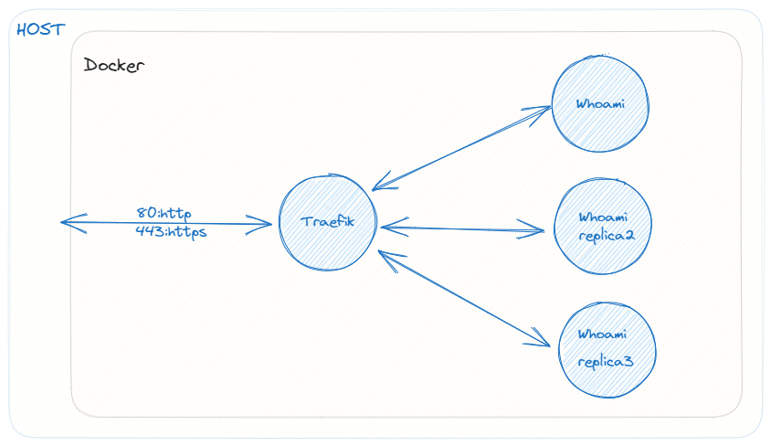

# Ansible IaC (Infrastructure as code)

[Ansible doc](https://docs.ansible.com/ansible/latest/installation_guide/intro_installation.html)

<p align="center">
    
</p>

## Roles
- [x] Essentials
- [x] Swap
- [x] Docker
- [x] Traefik
- [x] Reboot

## Setup
```
python3 -m venv venv
source venv/bin/activate
pip install -r requirements.txt
```

## Run
Add ssh config host name to `hosts`
```
ansible-playbook setup.yml
```

## Defaults
```
Swap: 2G
Traefik: auth
```

## TODOs
- [ ] Limit containers ram & cpu
- [ ] Disaster recovery plan
- [x] Docker compose v2
